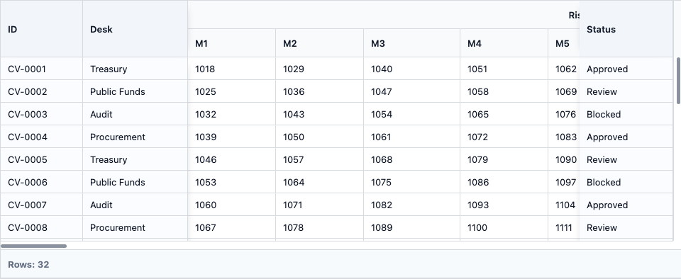
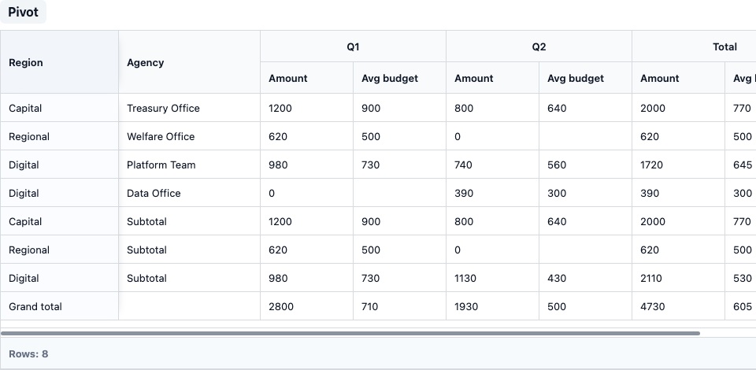
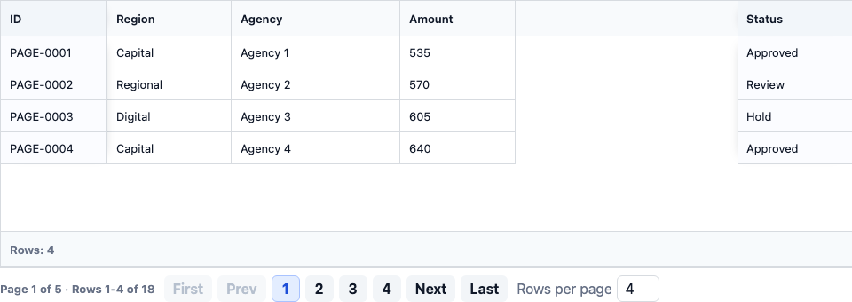

<div align="center">

# ⚡ OneGrid

### Enterprise-grade data grid foundation for high-volume business applications

OneGrid is a TypeScript-first frontend grid platform for financial, public-sector,
and SI environments where scale, security, accessibility, and long-term
maintainability are first-class requirements.


**Vanilla JS · TypeScript · React · Vue · npm/CDN-ready architecture**

</div>

> 🚧 **Status:** pre-1.0 development. The repository is building toward a
> commercial OneGrid 1.0 release.

---

## ✨ Preview

| Column Virtualization | Pivot | Pagination |
| --- | --- | --- |
|  |  |  |

---

## 🧭 Why OneGrid

OneGrid is not a table widget. It is a layered grid engine with separated core
logic, DOM rendering, framework wrappers, examples, documentation, and verification
assets.

| Area | What OneGrid Provides |
| --- | --- |
| 🧠 Core engine | DOM-free row, column, state, event, merge, sort, filter, selection, editing, grouping, aggregation, tree, pivot, and server contracts |
| 🖥 DOM renderer | Pinned panes, virtualized body/columns, keyboard focus, overlays, menus, editors, scrollbars, and ARIA semantics |
| ⚛ React | Lifecycle, prop, event, and ref bridge without reimplementing core behavior |
| 🟢 Vue | Component and expose bridge aligned with the same core API model |
| 🛡 Security | Escaped text defaults, sanitizer-ready HTML paths, CSP-conscious styling, and no `eval`/`new Function` design |
| 🧪 Quality | Unit, E2E, a11y, visual, and performance smoke test coverage |

---

## 🚀 Feature Coverage

| Category | Features |
| --- | --- |
| 📊 Columns | Column model, grouped headers, header merge, column menu, resize, reorder, visibility, left/right pinning |
| 🧱 Layout | Base layout, pinned panes, row virtualization, column virtualization, cell merge layout |
| 🌊 Row Models | Client, Infinite, Server, Viewport, Tree |
| 🧩 Core Features | Sorting, filtering, editing, selection, clipboard, menus, summary, grouping, tree, pivot, pagination |
| ♿ Accessibility | ARIA grid/treegrid semantics, keyboard focus, focus trap, screen-reader status regions |
| 🧪 Examples | Vanilla, React, and Vue variants for roadmap features |

Roadmap status and implementation evidence are tracked in [`CHECKLIST.md`](CHECKLIST.md).

---

## 📦 Packages

| Package | Purpose |
| --- | --- |
| `@onegrid/core` | DOM-free public types, models, state, events, and engine logic |
| `@onegrid/dom` | Vanilla DOM renderer and runtime |
| `@onegrid/react` | React lifecycle and ref bridge |
| `@onegrid/vue` | Vue component and expose bridge |
| `@onegrid/pagination` | Pagination state and page navigation helpers |
| `@onegrid/themes` | Theme tokens and default CSS |
| `@onegrid/adapters` | Server adapter foundations |
| `@onegrid/testing` | Test and benchmark helper foundation |

```text
apps/examples, apps/docs
  -> @onegrid/react, @onegrid/vue, @onegrid/dom
    -> @onegrid/dom
      -> @onegrid/core, @onegrid/pagination
```

Core does not depend on DOM APIs. Framework wrappers delegate to the DOM renderer
and core contracts rather than duplicating feature logic.

---

## ⚡ Quick Start

```bash
pnpm add @onegrid/core @onegrid/dom @onegrid/themes
```

```ts
import { OneGrid } from "@onegrid/dom";
import "@onegrid/themes/default.css";

interface OrderRow {
  id: string;
  customer: string;
  amount: number;
  status: "Approved" | "Review" | "Blocked";
}

const grid = new OneGrid<OrderRow>({
  el: document.querySelector("#grid")!,
  rowKey: "id",
  columns: [
    { field: "id", headerName: "ID", pinned: "left", width: 120 },
    { field: "customer", headerName: "Customer", width: 220 },
    { field: "amount", headerName: "Amount", type: "number", width: 140 },
    { field: "status", headerName: "Status", pinned: "right", width: 140 }
  ],
  data: [
    { id: "ORD-1001", customer: "Treasury Office", amount: 1200000, status: "Approved" },
    { id: "ORD-1002", customer: "Audit Bureau", amount: 430000, status: "Review" }
  ],
  layout: { width: "100%", height: 420 },
  accessibility: { label: "Orders grid" }
});

grid.setPage(1);
```

---

## 🛰 Server Row Model

Large datasets stay outside the browser. Server, infinite, and viewport row models
request only the current page, block, or viewport window.

```ts
const grid = new OneGrid<OrderRow>({
  el,
  rowKey: "id",
  rowModel: "server",
  columns,
  dataSource: {
    async getRows(request) {
      const response = await fetch("/api/orders/query", {
        method: "POST",
        headers: { "content-type": "application/json" },
        body: JSON.stringify(request)
      });

      return response.json();
    }
  },
  pagination: {
    mode: "server",
    position: "bottom",
    page: 1,
    pageSize: 100,
    pageSizeOptions: [50, 100, 250],
    pageGroupSize: 5
  }
});
```

---

## ⚛ React

```bash
pnpm add @onegrid/react @onegrid/core @onegrid/dom @onegrid/themes
```

```tsx
import { OneGrid } from "@onegrid/react";
import "@onegrid/themes/default.css";

export function OrdersGrid() {
  return (
    <OneGrid<OrderRow>
      rowKey="id"
      columns={columns}
      data={rows}
      layout={{ width: "100%", height: 420 }}
      accessibility={{ label: "Orders grid" }}
    />
  );
}
```

---

## 🟢 Vue

```bash
pnpm add @onegrid/vue @onegrid/core @onegrid/dom @onegrid/themes
```

```vue
<template>
  <OneGrid
    row-key="id"
    :columns="columns"
    :data="rows"
    :layout="{ width: '100%', height: 420 }"
    :accessibility="{ label: 'Orders grid' }"
  />
</template>

<script setup lang="ts">
import { OneGrid } from "@onegrid/vue";
import "@onegrid/themes/default.css";
</script>
```

---

## 🛠 Local Development

```bash
pnpm install
pnpm --filter @onegrid/examples dev --host 127.0.0.1 --port 4174
```

Open:

```text
http://127.0.0.1:4174
```

---

## ✅ Verification

```bash
pnpm lint
pnpm typecheck
pnpm test:unit
pnpm test:e2e
pnpm test:a11y
pnpm test:perf:smoke
pnpm build
pnpm docs:build
```

Visual regression smoke tests:

```bash
pnpm test:e2e:visual
```

---

## 🗂 Documentation Map

| Document | Purpose |
| --- | --- |
| [`ARCHITECT.md`](ARCHITECT.md) | Architecture goals, package boundaries, row model strategy |
| [`CHECKLIST.md`](CHECKLIST.md) | Roadmap, completion evidence, verification notes |
| [`API_CHANGELOG.md`](API_CHANGELOG.md) | API contract changes |
| [`SECURITY.md`](SECURITY.md) | Security policy notes |
| [`apps/docs/docs`](apps/docs/docs) | Docusaurus documentation source |

---

## 📜 License

License information is not finalized in this workspace. Add the project license
before publishing packages or distributing builds.
